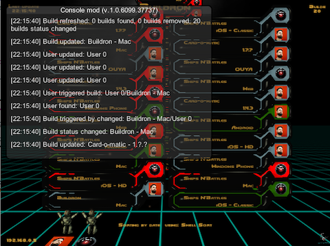

# Buildron-ConsoleMod

Mod that adds a console window to [Buildron](https://github.com/skahal/buildron) and let you monitor his events.

### FAQ
Having troubles? 

Ask on Twitter [@ogiacomelli](http://twitter.com/ogiacomelli).
 
 
### How to improve it?

Create a fork of [Buildron-ConsoleMod](https://github.com/giacomelli/Buildron-ConsoleMod/fork). 

Did you change it? [Submit a pull request](https://github.com/giacomelli/Buildron-ConsoleMod/pull/new/master).

### License
Licensed under the The MIT License (MIT).
In others words, you can use this library for developement any kind of software: open source, commercial, proprietary and alien.
